# Getting Started with head(amame)

Welcome to your head(amame) build journey! This guide will walk you through everything you need to know before starting your build, from tool requirements to first-time setup.

## Overview

Building head(amame) headphones is a rewarding project that combines 3D printing, electronics assembly, and audio engineering. The complete build process typically takes 2-3 weeks from start to finish, including printing time and component sourcing.

## Project Timeline

```mermaid
gantt
    title head(amame) Build Timeline
    dateFormat  X
    axisFormat %s
    
    section Planning
    Review Documentation    :done, plan, 0, 1
    Source Components      :active, source, 1, 3
    
    section Printing
    Print Main Components  :print1, 3, 5
    Print Small Parts      :print2, 5, 6
    
    section Assembly
    Prepare Components     :prep, 6, 7
    Main Assembly         :assem, 7, 8
    Wiring & Testing      :test, 8, 9
    
    section Finishing
    Final Assembly        :finish, 9, 10
    Tuning & Optimization :tune, 10, 11
```

## Skill Level Assessment

!!! question "Is head(amame) right for you?"
    
    **✅ You should build head(amame) if you have:**
    
    - Experience with 3D printing (can troubleshoot common issues)
    - Basic soldering skills (through-hole components)
    - Patience for detailed assembly work
    - Access to required tools and workspace
    - Budget of $180-285 USD
    
    **❌ Consider [min(amame)](../../min-amame/) instead if you:**
    
    - Are new to 3D printing
    - Have never soldered before
    - Want a faster, simpler build
    - Have budget constraints under $150

## Required Skills

=== "🖨️ 3D Printing"
    
    **Intermediate Level Required**
    
    - Bed leveling and calibration
    - Support structure optimization
    - Layer adhesion troubleshooting
    - Post-processing (sanding, drilling)
    
    **Recommended Experience:**
    - 6+ months of FDM printing
    - Successfully printed complex models
    - Comfortable with slicer settings

=== "⚡ Electronics"
    
    **Basic to Intermediate Level**
    
    - Through-hole soldering
    - Wire stripping and crimping
    - Basic multimeter usage
    - Component identification
    
    **You'll Learn:**
    - Proper headphone wiring
    - Driver connection techniques
    - Cable assembly methods

=== "🔧 Assembly"
    
    **Beginner to Intermediate**
    
    - Following detailed instructions
    - Using hand tools safely
    - Basic mechanical assembly
    - Problem-solving mindset

## Pre-Build Checklist

Before ordering components or starting to print, complete this checklist:

### 📋 Planning Phase

- [ ] Read complete documentation (estimated 2-3 hours)
- [ ] Watch build videos on [YouTube](https://youtube.com/@headamame)
- [ ] Join [Discord community](https://discord.gg/headamame) for support
- [ ] Assess skill level against requirements
- [ ] Confirm workspace and tool availability

### 🛠️ Tool Verification

- [ ] [Review required tools list](required-tools.md)
- [ ] Verify 3D printer compatibility
- [ ] Check soldering station functionality
- [ ] Ensure measurement tools are available

### 💰 Budget Planning

- [ ] Calculate total project cost using our [BOM](../technical/bom.md)
- [ ] Account for shipping costs and taxes
- [ ] Plan for potential material failures/reprints
- [ ] Consider upgrade options for future

### 📦 Component Sourcing

- [ ] Review [Bill of Materials](../technical/bom.md)
- [ ] Check component availability in your region
- [ ] Place orders with recommended suppliers
- [ ] Verify delivery timeline matches printing schedule

## First-Time Builder Recommendations

!!! tip "New to DIY headphones?"
    
    **Start with our proven path:**
    
    1. **Begin with the [tool guide](required-tools.md)** - Don't skip any recommended tools
    2. **Use our exact [BOM suppliers](../technical/bom.md)** - Avoid substitutions on your first build
    3. **Follow [print settings](../build-guide/3d-printing.md) exactly** - Our settings are thoroughly tested
    4. **Take photos during assembly** - Helpful for troubleshooting and community sharing
    5. **Join Discord BEFORE starting** - Get real-time help when issues arise

## Common First-Build Mistakes

Learn from others' experiences and avoid these common pitfalls:

!!! warning "Print Quality Issues"
    
    **Problem**: Poor layer adhesion on curved surfaces  
    **Solution**: Use our tested print orientation and support settings
    
    **Problem**: Dimensional inaccuracy affecting fit  
    **Solution**: Calibrate your printer with test prints first

!!! warning "Component Issues"
    
    **Problem**: Wrong driver model ordered  
    **Solution**: Triple-check part numbers against our BOM
    
    **Problem**: Insufficient wire gauge for connections  
    **Solution**: Use exactly the wire specifications we recommend

!!! warning "Assembly Problems"
    
    **Problem**: Forcing parts that don't fit properly  
    **Solution**: Stop and troubleshoot - parts should fit with minimal force
    
    **Problem**: Skipping the test phase  
    **Solution**: Always test electrical connections before final assembly

## Getting Help

When you inevitably run into questions or issues:

### 🚀 Quick Help

- **[FAQ](../../support/faq.md)**: Most common questions answered
- **[Troubleshooting Guide](../../support/troubleshooting.md)**: Step-by-step problem solving
- **Discord #help Channel**: Real-time community support

### 📖 Deep Dive Resources

- **[Technical Documentation](../technical/)**: In-depth specifications and theory
- **[Community Mods](../customization/community-mods.md)**: Learn from others' improvements
- **[Build Gallery](../../community/build-gallery.md)**: See successful builds for inspiration

### 🎥 Visual Learning

- **Assembly Videos**: Step-by-step build footage
- **Troubleshooting Clips**: Common issues and solutions
- **Community Builds**: Different approaches and materials

## Success Stories

!!! success "First-time builder - @maker_newbie"
    
    *"I was nervous about the electronics but the documentation is incredible. Took my time with each step and ended up with headphones that sound better than my $600 commercial set!"*

!!! success "Experienced maker - @print_perfectionist"
    
    *"The modular design is brilliant. I've already printed three different acoustic chamber variants to tune the sound exactly how I like it."*

## Ready to Begin?

If you've completed the checklist and feel confident about the requirements, you're ready to start your head(amame) journey!

**Next Steps:**

1. **[Check Required Tools](required-tools.md)** - Verify you have everything needed
2. **[Review Kit Contents](kit-contents.md)** - Understand what you'll be building
3. **[Plan Your First Build](first-build.md)** - Get a detailed roadmap

[Continue to Required Tools](required-tools.md){ .md-button .md-button--primary }

---

*Remember: The head(amame) community is here to help. Don't hesitate to ask questions - we all started as beginners!*